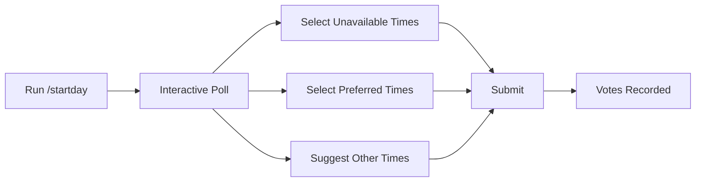

# 🤖 DailyMeetBot

<div align="center">

[](https://discord.js.org/)
[](https://nodejs.org/)
[](LICENSE)

**An intelligent Discord bot that helps teams coordinate daily meetings through interactive polls and smart scheduling.**

[Features](#-features) • [Quick Start](#-quick-start) • [Commands](#-commands) • [Configuration](#%EF%B8%8F-configuration) • [Contributing](#-contributing)

</div>

---

## ✨ Features

### 🌐 **Multi-Server Support**
- Works seamlessly across unlimited Discord servers
- Complete isolation between servers (independent configs, schedules, and votes)
- Automatic per-server configuration management
- Clean automatic cleanup when removed from a server

### 📊 **Interactive Availability Polling**
- Intuitive multi-select menus with improved UX (preferred times first)
- Custom time slot suggestions with automatic 30-minute chunking
- Real-time vote tracking across all team members
- Clear visual feedback and conversational responses

### 🧠 **Smart Decision Engine**
- Advanced scoring algorithm: `-100` for unavailable, `+2` for preferred, `+1` for suggested
- Top 5 ranking with emoji indicators (🏆 for best time)
- Comprehensive analysis breakdown showing all time slots with vote counts
- Automatic recommendation of the best meeting time

### ⏰ **Automated Scheduling**
- Set up daily polls to post automatically at your chosen time
- Configurable channel and @everyone or custom role tagging
- Easy enable/disable without losing configuration
- Persistent schedules across bot restarts

### 🔧 **Flexible Time Management**
- Add/remove time slots on the fly
- Support for custom time ranges (e.g., "09:00-11:00" splits into 30-min slots)
- Persistent per-server configuration stored in `guilds/` directory

### 🛡️ **Admin Controls**
- Role-based or permission-based admin access
- Comprehensive help system with contextual documentation
- Real-time status monitoring with `/status` command

---

## 🚀 Quick Start

### Prerequisites

- Node.js v20 or higher
- A Discord Bot Token ([Create one here](https://discord.com/developers/applications))
- Discord server with admin permissions

### Installation

```bash
# Clone the repository
git clone https://github.com/lakshyajain-0291/dailymeetbot.git
cd dailymeetbot

# Install dependencies
npm install

# Create environment file
cp .env.example .env
```

### Configuration

1. **Set up your Discord Bot:**
   - Go to [Discord Developer Portal](https://discord.com/developers/applications)
   - Create a new application
   - Add a bot and copy the token
   - Enable "Message Content Intent" and "Server Members Intent"

2. **Add token to `.env`:**
   ```env
   DISCORD_TOKEN=your_bot_token_here
   ```

3. **Invite bot to your server:**
   ```
   https://discord.com/oauth2/authorize?client_id=YOUR_CLIENT_ID&permissions=2147863616&scope=bot%20applications.commands
   ```

4. **Start the bot:**
   ```bash
   # Development mode (auto-restart on changes)
   npm run dev

   # Production mode
   node index.js
   ```

---

## 📖 Commands

### 👥 User Commands

| Command | Description | Example |
|---------|-------------|---------|
| `/startday` | Post today's availability poll | Simply run the command |
| `/decide` | Analyze votes and recommend best meeting time | Run after team has voted |
| `/listslots` | View all configured time slots | Check available times |
| `/status` | Show bot configuration and schedule status | See current setup |
| `/help` | Display comprehensive help guide | Get detailed usage info |

### 🔐 Admin Commands

| Command | Description | Example |
|---------|-------------|---------|
| `/addslot <slot>` | Add a new time slot to polls | `/addslot slot:09:00–09:30` |
| `/removeslot <slot>` | Remove an existing time slot | `/removeslot slot:23:00–23:30` |
| `/schedule` | Set up automatic daily poll posting | `/schedule time:09:00 channel:#daily role:@Team` |
| `/enableschedule` | Enable auto-posting with saved settings | Run to turn on schedule |
| `/unschedule` | Disable automatic posting | Run to turn off schedule |

---

## 🎯 Usage Examples

### Setting Up Daily Polls

```
1. Configure time slots (if needed):
   /addslot slot:09:00–09:30
   /addslot slot:14:00–14:30

2. Set up automatic posting:
   /schedule time:09:00 channel:#daily-meets role:@Team

3. The bot will now post polls daily at 9:00 AM!
```

### Marking Availability

<div align="center">



</div>

</div>

**Custom Time Format:**
```
09:00-09:30     → Single 30-min slot
14:00-16:00     → Four 30-min slots (14:00-14:30, 14:30-15:00, etc.)
21:30-22:00     → Single 30-min slot
```

### Getting Results

```
/decide
```

**Sample Output:**
```
📊 Meeting Time Analysis

🏆 15:00–15:30
   ✅ 4 prefer • 💡 1 suggest
   Score: 9

1️⃣ 11:00–11:30
   ✅ 2 prefer
   Score: 4

2️⃣ 17:00–17:30
   ✅ 1 prefer • ❌ 1 busy
   Score: -98

3️⃣ 09:00–09:30
   💡 1 suggest
   Score: 1

🎯 Best time to meet: 15:00–15:30

This time has the highest preference score!
```

---

## ⚙️ Configuration

### Multi-Server Support

DailyMeetBot supports **multiple Discord servers simultaneously** with complete isolation:

- ✅ **Independent Configurations**: Each server has its own config file in `guilds/{guildId}.json`
- ✅ **Separate Time Slots**: Different time slots, schedules, and admin settings per server
- ✅ **Isolated Vote Tracking**: State management is completely independent between servers
- ✅ **Automatic Cleanup**: Config files are automatically deleted when bot leaves a server
- ✅ **Zero Interference**: Actions in one server never affect another server

### Server Configuration Storage

Each server's config is automatically stored as `guilds/{guildId}.json`:

```json
{
  "timeslots": [
    "11:00–11:30",
    "15:00–15:30",
    "17:00–17:30",
    "18:00–18:30",
    "20:00–20:30",
    "23:00–23:30"
  ],
  "adminRoleId": "",
  "autoSchedule": {
    "enabled": true,
    "channelId": "1454403088482832432",
    "time": "09:00",
    "timezone": "Asia/Kolkata",
    "tagRole": "1454403087480651886"
  }
}
```

**Configuration Fields:**
- `timeslots`: Array of available meeting times (HH:MM–HH:MM format)
- `adminRoleId`: Optional role ID for admin permissions (empty = use Discord admin perms)
- `autoSchedule.enabled`: Whether automatic daily polls are active
- `autoSchedule.channelId`: Channel ID where polls are posted
- `autoSchedule.time`: Time to post polls (HH:MM in 24-hour format)
- `autoSchedule.timezone`: Timezone for scheduling (default: Asia/Kolkata)
- `autoSchedule.tagRole`: Role ID to mention (if equals guildId, uses @everyone)

### Environment Variables

| Variable | Description | Required |
|----------|-------------|----------|
| `DISCORD_TOKEN` | Your Discord bot token | Yes |

---

## 🏗️ Architecture

```
dailymeetbot/
├── index.js              # Main bot logic with multi-server support
├── guilds/               # Per-server configuration directory
│   ├── {guildId1}.json  # Server 1 config
│   ├── {guildId2}.json  # Server 2 config
│   └── ...              # Additional server configs
├── .env                 # Environment variables (DISCORD_TOKEN)
├── .env.example         # Template for environment setup
├── package.json         # Dependencies and scripts
├── README.md           # Documentation
├── ARCHITECTURE.md     # Detailed architecture docs
├── TESTING.md          # Testing guide
└── LICENSE             # ISC License

```

### Key Components

- **Multi-Server Architecture**: Map-based state management with per-guild isolation
- **Interactive Polls**: Discord.js Select Menus + Buttons with improved UX
- **State Management**: In-memory per-guild state with Set collections for vote tracking
- **Scheduling**: Interval-based time checking (1-minute precision) per server
- **Persistence**: JSON file-based configuration in `guilds/` directory
- **Auto-cleanup**: Removes config when bot leaves a server

---

## 🤝 Contributing

Contributions are welcome! Here's how you can help:

1. **Fork the repository**
2. **Create a feature branch** (`git checkout -b feature/AmazingFeature`)
3. **Commit your changes** (`git commit -m 'Add some AmazingFeature'`)
4. **Push to the branch** (`git push origin feature/AmazingFeature`)
5. **Open a Pull Request**

### Development Guidelines

- Follow existing code style
- Test all changes thoroughly
- Update README for new features
- Add console logs for debugging
- Test multi-server scenarios when making config changes
- Verify per-guild isolation for state management features

### Recent Improvements

- ✅ Multi-server support with complete isolation
- ✅ Improved UX: Reordered menus (preferred times first)
- ✅ Fixed @everyone role tagging in auto-scheduled posts
- ✅ Enhanced `/decide` output with top 5 ranking and emoji indicators
- ✅ Better response messages with conversational tone
- ✅ Persistent per-server configurations in `guilds/` directory

---

## 🐛 Troubleshooting

<details>
<summary><b>Bot doesn't respond to commands</b></summary>

- Verify bot token in `.env`
- Check bot has proper permissions in Discord
- Ensure bot is online in your server
- Wait 1-2 minutes for slash commands to register after inviting bot
- Check console for error messages
</details>

<details>
<summary><b>"Application did not respond" or "thinking..." timeout</b></summary>

- This can occur due to network latency or SSL interception (e.g., institutional networks)
- Commands still execute successfully - check bot logs
- In development: Set `NODE_TLS_REJECT_UNAUTHORIZED='0'` in `.env` if behind SSL inspection
- In production: Deploy to a server without SSL interception
- Responses are deferred to prevent timeouts
</details>

<details>
<summary><b>Schedule not working</b></summary>

- Use `/status` to verify schedule is enabled
- Check that the time format is HH:MM in 24-hour format
- Verify bot has permission to post in the configured channel
- Ensure system time is accurate
- Check bot logs for scheduling confirmation messages
</details>

<details>
<summary><b>@everyone not working in scheduled posts</b></summary>

- Make sure you selected @everyone when setting up `/schedule`
- Bot checks if tagRole matches guildId to use @everyone properly
- Verify bot has "Mention @everyone, @here, and All Roles" permission
</details>

<details>
<summary><b>Multi-server issues / config conflicts</b></summary>

- Each server has completely isolated configuration
- Check `guilds/` directory for individual server configs
- Server config files are named `{guildId}.json`
- Removing bot from server automatically deletes its config
- Use `/status` in each server to verify individual configurations
</details>

<details>
<summary><b>Development: SSL certificate errors</b></summary>

- Common on institutional networks (universities, companies) with SSL inspection
- Quick fix for development: Add to `.env`:
  ```
  NODE_TLS_REJECT_UNAUTHORIZED=0
  ```
- **WARNING**: Only use in development, never in production
- Alternative: Use a VPN or different network
</details>

---

## 📝 License

This project is licensed under the ISC License - see the [LICENSE](LICENSE) file for details.

---

## 🙏 Acknowledgments

- Built with [Discord.js](https://discord.js.org/)
- Inspired by the need for better team coordination
- Thanks to all contributors!

---

<div align="center">

**Made by [Lakshya Jain](https://github.com/lakshyajain-0291)**

⭐ Star this repo if you find it helpful!

</div>
